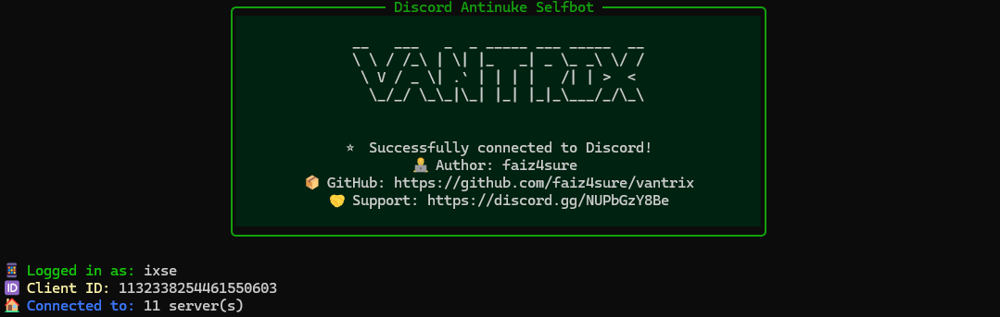
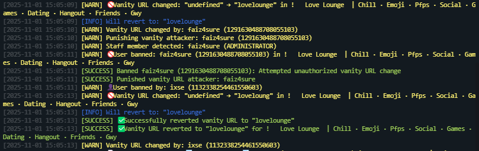

<div align="center">

<p align="center">
  
</p>

[](https://discord.gg/NUPbGzY8Be)
[](https://github.com/faiz4sure/vantrix/stargazers)
[](https://www.gnu.org/licenses/gpl-3.0)
[](https://nodejs.org/)
[](https://en.wikipedia.org/wiki/India)

<br />

<p align="center">
  
</p>

</div>

## 🎯 **Revolutionary Vanity URL Protection**

Vantrix is the **first open source working selfbot** that can actually revert unauthorized vanity URL changes in real-time. This breakthrough feature sets it apart from all other selfbots.

### **⚡ Key Capabilities**
- **Instant Reversion**: Changes reverted within seconds using automated MFA authentication
- **Smart Detection**: Distinguishes legitimate admin changes from malicious attempts
- **Multi-Server Support**: Protect vanity URLs across multiple Discord servers simultaneously

---

## 🛡️ **Complete Anti-Nuke Protection Suite**

### **📊 Protection Matrix**

| Threat Type | Detection | Response | Recovery |
|-------------|-----------|----------|----------|
| **Mass Bans** | ✅ Real-time | Punishment | Auto-unban victims |
| **Mass Kicks** | ✅ Real-time | Punishment | DM invites sent |
| **Channel Deletion** | ✅ Instant | Punishment | Auto-restore channels |
| **Role Deletion** | ✅ Instant | Punishment | Auto-restore roles |
| **Vanity Changes** | ✅ Instant | Punishment | Auto revert |
| **Member Updates** | ✅ Smart | Context-aware | Selective recovery |

### **🎯 Advanced Features**
- **Smart Role Filtering**: Ignores onboarding/autorole actions
- **Rate Limiting**: Prevents API abuse and detection
- **Multi-Server Support**: Protect multiple servers simultaneously
- **Owner Whitelisting**: Trusted users bypass all protections
- **Configurable Thresholds**: Adjustable sensitivity levels

## 📦 Installation

**Requirements:** Node.js 18+ and a Discord user token

```bash
# Clone the repository
git clone https://github.com/faiz4sure/vantrix.git
cd vantrix

# Install dependencies
npm install

# Configure your settings
nano config.yml  # Edit with your token, server IDs, etc.

# Start the bot
node index.js
```

### **🚀 Startup Preview**
<div align="center">
  
  <p><em>Beautiful startup banner with protection status</em></p>
</div>

## ⚙️ Configuration

<details>
<summary><strong>📦 Quick Configuration</strong></summary>

```yaml
selfbot:
  token: "YOUR_DISCORD_TOKEN"  # ⚠️  NEVER SHARE THIS
  server1_id: "1234567890123456789"  # Your server ID
  owner1_id: "9876543210987654321"   # Your user ID

antinuke_settings:
  punishment: "ban"  # ban, kick, or none
  auto_recovery: true
  ignored_role_ids: ["1111111111111111111"]  # Onboarding/autorole IDs

vanity_reversion:
  password: "YOUR_DISCORD_PASSWORD"  # For vanity protection
  fallback_vanity: "myserver"  # Backup vanity code
```

</details>

<details>
<summary><strong>🔧 Advanced Configuration</strong></summary>

```yaml
# Protection thresholds
ban_limit: 5        # Max bans per time window
kick_limit: 5       # Max kicks per time window
time_window: 36000000  # 10 hours in milliseconds

# Recovery settings
recover_channels: true
recover_roles: true
recovery_delay: 1500  # ms between recoveries

# Logging
log_webhook: "https://discord.com/api/webhooks/..."
log_owner_dm: true
```

</details>

## 🔍 **Vanity Protection in Action**

<div align="center">
  
  <p><em>Real-time console logs showing vanity URL attack detection and reversion</em></p>
</div>

<div align="center">
  
  <p><em>Discord audit logs proving the vanity URL was successfully reverted</em></p>
</div>

## 📚 Documentation

- **[🔑 Get Token Guide](docs/Get_Token.md)** - How to extract your Discord user token
- **[📱 Android Setup](docs/Android.md)** - Run Vantrix on Android (Termux)
- **[⚙️ Config Guide](docs/Config_Guide.md)** - Complete configuration reference

## 🏗️ Architecture

```
Vantrix/
├── index.js              # Main entry point
├── config.yml            # Configuration file
├── docs/                 # Documentation
├── handlers/
│   ├── EventsHandler.js  # Event management
│   └── Anticrash.js      # Crash protection
└── utils/
    ├── AntiNukeManager.js # Core protection logic
    ├── Logger.js          # Logging system
    ├── WhitelistManager.js # User management
    └── RateLimitManager.js # API rate limiting
```

## 🤝 Contributing

We welcome contributions! Please:
1. Fork the repository
2. Create a feature branch
3. Submit a pull request
4. Follow our coding standards

## 📞 Support & Community

<div align="center">

[](https://discord.gg/NUPbGzY8Be)
[](https://github.com/faiz4sure/vantrix/issues)

</div>

## 🙏 Credits & Acknowledgments

### Core Development Team
- **faiz4sure** - Lead Developer & Project Creator
- **Team Zyrus** - Development & Testing

### Special Thanks
- **SS Bhai** - Critical contribution to vanity URL reversion system testing and optimization
- **Discord.js-selfbot-v13** - Underlying framework
- **Open source community** - Inspiration and tools

## 📄 License

This project is licensed under the GNU GPL v3.0 License - see the [LICENSE](LICENSE) file for details.

## ⚠️ Disclaimer

This tool is for educational and legitimate server protection purposes only. Users are responsible for complying with Discord's Terms of Service. The developers are not responsible for any misuse or violations.

---

<div align="center">
  <h3>🛡️ <strong>SECURITY & INTEGRITY NOTICE</strong> 🛡️</h3>
  <p><strong>This codebase is completely secure from the developer's side - no token grabbers, no information logging, no malicious code. This is a legitimate protection tool, not a harmful selfbot. If you have any concerns or questions about security, join our Discord support server for transparent discussion.</strong></p>
  <p><em>The first ever open source working vanity URL reversion system. Don't waste time trying to copy or skid this - focus on creating something original instead.</em></p>
</div>

---

<div align="center">

**Built with ❤️ in India by Team Zyrus** 🇮🇳

<p align="center">
  
</p>

</div>
